# DACT CCIP Bridge, Ethereum - BNB Chain

Bridges **Dac Token (DACT)** between Ethereum mainnet and BNB Smart Chain using
[Chainlink CCIP](https://docs.chain.link/ccip)'s self-serve **Cross-Chain Token (CCT)** standard.

**The bridge is live on mainnet.** To move your DACT, jump to
[Bridge your DACT](#bridge-your-dact).

## Official addresses

| Contract | Ethereum mainnet | BNB Smart Chain |
| --- | --- | --- |
| DACT token | [`0x0d9e0916eA60D5439F1535BEA4cB83b25780Eb36`](https://etherscan.io/token/0x0d9e0916eA60D5439F1535BEA4cB83b25780Eb36) (canonical) | [`0x9D1C28CC64409E15d7c0b80De4D0a7692095Ad2A`](https://bscscan.com/token/0x9D1C28CC64409E15d7c0b80De4D0a7692095Ad2A) (bridged) |
| Token pool | [`0xdE61BAE56E79306B0b42Bf3297F3c138347099B7`](https://etherscan.io/address/0xdE61BAE56E79306B0b42Bf3297F3c138347099B7) (LockRelease) | [`0xdE61BAE56E79306B0b42Bf3297F3c138347099B7`](https://bscscan.com/address/0xdE61BAE56E79306B0b42Bf3297F3c138347099B7) (BurnMint) |
| CCIP router | `0x80226fc0Ee2b096224EeAc085Bb9a8cba1146f7D` | `0x34B03Cb9086d7D758AC55af71584F81A598759FE` |
| Admin (Safe, 3-of-5) | [`0x11e422578aD6517CEe36e0eda36089Ce9022761f`](https://app.safe.global/home?safe=eth:0x11e422578aD6517CEe36e0eda36089Ce9022761f) | [`0x265d3599f9f1c7445BfcfaaA7e4176c927C4eAb4`](https://app.safe.global/home?safe=bnb:0x265d3599f9f1c7445BfcfaaA7e4176c927C4eAb4) |

> **Only use these addresses.** Any other "DACT" on BNB Chain is not backed by this
> bridge. Never send DACT directly to a pool or token address: tokens sent that
> way are not bridged and cannot be recovered. Always bridge through the CCIP router.

## Architecture

The canonical DACT has a fixed 1B supply and no mint function, so the home chain
uses **lock/release** and the destination chain uses **burn/mint**:



- **Ethereum → BSC**: DACT locked in the Ethereum pool, equal amount minted on BSC.
- **BSC → Ethereum**: DACT burned on BSC, equal amount released from the Ethereum pool.
- BSC supply therefore always equals the DACT locked in the Ethereum pool.
- The BSC token ([contracts/DacToken.sol](contracts/DacToken.sol)) mirrors the canonical
  metadata (name/symbol/decimals, ERC20Permit) and hard-caps supply at 1B. Mint/burn is
  restricted by AccessControl roles held only by the pool.
- Pools are Chainlink's audited `LockReleaseTokenPool` / `BurnMintTokenPool`
  (`@chainlink/contracts-ccip` 1.6.4), deployed as-is — this repo adds no custom pool logic.

## Bridge your DACT

You can bridge in two ways. Both make the same calls to the CCIP router.

- **[Web app](#with-metamask-web-app)** (recommended): a local web page that uses
  MetaMask. Your private key stays in your wallet.
- **[Script](#with-the-script)**: `scripts/06_bridge_tokens.js`, run from the
  command line with the wallet's private key in `.env`. Unlike the web app, it
  can also pay the CCIP fee in LINK.

[Delivery](#delivery), [Costs](#costs) and [Limits](#limits) are the same for both.

### With MetaMask (web app)

The web app in [`webapp/`](webapp/) runs on your machine. You need Node.js 18+,
a browser with the [MetaMask](https://metamask.io/download/) extension, and in that
wallet the DACT you want to bridge plus gas on the **source** chain (ETH on
Ethereum, BNB on BSC).

```bash
npm run webapp     # from the repo root: installs webapp/ and starts it
# or: cd webapp && npm install && npm run dev
```

Then open http://localhost:5173. Opening `webapp/index.html` directly as a file
does not work; the page must come from this dev server.

1. Click **Connect MetaMask**. Keep **Mainnet** selected at the top; **Testnet**
   switches to Sepolia ↔ BSC Testnet.
2. Pick the direction with the ↓↑ button and enter an amount (or click **MAX**).
3. Check the CCIP fee, available bridge capacity, and estimated delivery shown
   below the amount.
4. Click the button and confirm each request in MetaMask. The button walks
   you through each step:
   - **Switch MetaMask to …**: switches the wallet to the source chain, and adds
     BNB Chain to MetaMask if it is missing.
   - **Approve … DACT**: allows the CCIP router to move exactly that amount.
   - **Bridge to …**: sends the transfer, paying the CCIP fee in ETH or BNB.
5. The **Transfer** card then tracks delivery. It links to the source transaction
   and to the CCIP Explorer, and marks the transfer delivered when the DACT arrives.
   It keeps tracking if you reload the page.

To send to another address, open **Send to a different address**. Use only an
address you control **on the destination chain**: a Safe or other smart-contract
wallet does not automatically exist at the same address on the other chain, and
many exchanges do not credit deposits that arrive through a bridge. The page
warns you if the address is a contract on the destination chain.

The page blocks the transfer before anything is signed if the amount is more than
your balance or the bridge capacity available right now, or if you lack gas
for the fee. **Add to MetaMask** (under *Official addresses*, or on the
Transfer card) adds DACT to your wallet on that chain.

By default the page reads balances, fees and rate limits through public RPC servers.
To use your own, copy `webapp/.env.example` to `webapp/.env.local` and set the
`VITE_*_RPC_URL` values. These values are bundled into the page, so never put
keys there. The web app never reads the root `.env`. More details are in
[webapp/README.md](webapp/README.md).

### With the script

`scripts/06_bridge_tokens.js` bridges from the chain you run it on to the other one.
It approves the CCIP router, quotes the fee, sends the transfer, and prints a
link to track delivery.

#### What you need

- Node.js 18+ and git
- A wallet holding the DACT you want to bridge, plus gas on the **source** chain:
  ETH on Ethereum, BNB on BSC. The CCIP fee is paid in that same native coin.
- The wallet's private key. The script signs locally with it; it is never sent
  anywhere. Prefer a dedicated wallet holding only what you are bridging.
- Optionally, your own RPC URLs (Alchemy, Infura, …). Public fallbacks are used
  otherwise, and they can be unreliable.

#### 1. Install

```bash
git clone <this repo> && cd dac-token-ccip
npm install
cp .env.example .env
```

In `.env`, set:

```bash
DEPLOYER_PRIVATE_KEY=0x...   # the key of the wallet sending the DACT (the name is historical)
MAINNET_RPC_URL=https://...  # optional
BSC_RPC_URL=https://...      # optional
```

#### 2. Send

```bash
# Ethereum -> BNB Chain
AMOUNT=100 npx hardhat run scripts/06_bridge_tokens.js --network mainnet

# BNB Chain -> Ethereum
AMOUNT=100 npx hardhat run scripts/06_bridge_tokens.js --network bsc
```

| Variable | Meaning |
| --- | --- |
| `AMOUNT` | Whole DACT to bridge (decimals allowed, e.g. `12.5`). Required. |
| `RECEIVER` | Address that receives the DACT on the other chain. Defaults to your own address. |
| `FEE_TOKEN` | `native` (default) or `link`, to pay the CCIP fee in LINK instead (~10% cheaper; you need LINK on the source chain). |

Only set `RECEIVER` to an address you control **on the destination chain**. A
smart-contract wallet (e.g. a Safe) does not automatically exist at the same
address on the other chain, and many exchanges do not credit deposits that
arrive through a bridge.

The script prints the CCIP fee before sending, then:

```
Sent. Tx: 0x…
Track: https://ccip.chain.link/msg/0x…
```

#### 3. Wait for delivery

Open the `Track` link to follow the transfer.

### Delivery

The tokens arrive at the receiver automatically; there is nothing to claim.

| Direction | Typical delivery | Why |
| --- | --- | --- |
| Ethereum → BSC | 15–20 minutes | CCIP waits for Ethereum finality |
| BSC → Ethereum | 1–2 minutes | |

To see DACT in your wallet on BNB Chain, add the token
`0x9D1C28CC64409E15d7c0b80De4D0a7692095Ad2A` (symbol DACT, 18 decimals).

### Costs

You pay a flat CCIP fee per transfer — the same for 1 DACT or 1,000,000 DACT —
plus gas for the approve and send transactions. Measured on 2026-09-23 (ETH ≈ $2,730,
BNB ≈ $780, Ethereum gas ≈ 1 gwei):

| Direction | CCIP fee + gas |
| --- | --- |
| Ethereum → BSC | ≈ 0.0006 ETH (≈ $1.75) |
| BSC → Ethereum | ≈ 0.006 BNB (≈ $4.60) |

Most of the fee pays for gas on the destination chain, so both directions get
more expensive when Ethereum gas prices rise. The web app and the script both show
the exact fee before sending. The fee goes to Chainlink; the DACT pools charge nothing.

### Limits

Each direction has a rate limit of **6,000,000 DACT** that refills continuously
(fully in about 1 hour). A transfer larger than the currently available amount
fails. The web app disables the Bridge button and shows the capacity available
right now. The script stops before sending, so no DACT moves and you only pay gas
for the approval. Split very large transfers or retry later.

### Without this repo

Any wallet or script can bridge by calling the CCIP router directly:

1. `approve(router, amount)` on the DACT token of the source chain.
2. `getFee(destChainSelector, message)` on the router, then
   `ccipSend(destChainSelector, message)` with the fee as `msg.value`.

Chain selectors: Ethereum `5009297550715157269`, BNB Chain `11344663589394136015`.
The `message` is `{ receiver: abi.encode(receiver), data: "0x",
tokenAmounts: [{ token, amount }], feeToken: address(0), extraArgs: "0x" }` —
see [scripts/06_bridge_tokens.js](scripts/06_bridge_tokens.js).

DACT is not yet listed on [Transporter](https://www.transporter.io/), Chainlink's
bridging app; a listing requires verification by Chainlink.

## Mainnet deployment record

Deployed and configured on 2026-09-23. Addresses are also in
`deployments/mainnet.json` / `deployments/bsc.json`.

- Rate limits: 6,000,000 DACT capacity, refilling at ~1,667 DACT/s, both
  directions, inbound and outbound.
- Pool allowlist: disabled (anyone can bridge). No rebalancer is set on the
  Ethereum pool, so locked DACT cannot be withdrawn outside of CCIP releases.
- All admin rights — pool ownership, TokenAdminRegistry admin, the BSC token's
  `DEFAULT_ADMIN_ROLE` and CCIP admin, and the Ethereum token's `owner()` — are held by
  the Safes above. The deployer key holds none.

Round-trip test (10 DACT):

- **Ethereum → BSC** (lock + mint): [CCIP message](https://ccip.chain.link/msg/0x501115d56c2714b0a4dbf8a6a7b8bbf0e95fd63b7df6dd1177ab5258089ee011)
- **BSC → Ethereum** (burn + release): [CCIP message](https://ccip.chain.link/msg/0x989a776e844668a7be972e82d8d2613a9556c3f56a3a2b76c68aefb63a467d35)

Both legs settled exactly: the Ethereum pool balance and BSC total supply
returned to zero after the round trip.

## Layout

| Path | Purpose |
| --- | --- |
| `contracts/DacToken.sol` | Burn/mint DACT representation for BNB Chain |
| `contracts/CCIPImports.sol` | Pulls Chainlink pool/registry artifacts into the build |
| `contracts/mocks/` | Mainnet-token replica + router/RMN mocks (tests & testnet rehearsal) |
| `config/networks.js` | CCIP routers, chain selectors, registries per network |
| `scripts/01…07_*.js` | Step-by-step deployment, registration, bridging, and admin handover |
| `deployments/` | Deployed addresses per network |
| `test/` | Token unit tests, end-to-end pool mechanics, admin handover |
| `webapp/` | Local MetaMask bridge page (Vite + ethers) |

## Deploying (maintainers)

This section documents how the bridge was deployed. Holders do not need it.

```bash
npm install        # postinstall symlinks the Foundry-style OZ aliases for Hardhat
npx hardhat test
```

Copy `.env.example` to `.env` and fill in RPC URLs, the deployer key, and an Etherscan v2 API key.
Run each script with `npx hardhat run scripts/<script> --network <network>`.
Deployed addresses are recorded in `deployments/<network>.json` (committed —
step 5 reads the *other* chain's file).

| # | Script | Ethereum (`--network mainnet`) | BNB Chain (`--network bsc`) |
| --- | --- | --- | --- |
| 1 | `01_deploy_token.js` | — (canonical token exists) | Deploy burn/mint DacToken |
| 2 | `02_deploy_pool.js` | Deploy LockReleaseTokenPool | Deploy BurnMintTokenPool |
| 3 | `03_claim_admin.js` | run as the token's `owner()` | run as the token's CCIP admin |
| 4 | `04_accept_admin_and_set_pool.js` | accept + setPool | accept + setPool + grant pool mint/burn |
| 5 | `05_apply_chain_updates.js` | wire to BSC pool + rate limits | wire to Ethereum pool + rate limits |
| 6 | `06_bridge_tokens.js` | `AMOUNT=… RECEIVER=…` bridge out | bridge back |
| 7 | `07_transfer_ownership.js` | `SAFE=…` hand pool + registry admin to the Safe | same, plus token admin |

Steps 3–4 use CCIP's permissionless registration: `RegistryModuleOwnerCustom`
proves token ownership on-chain, then `TokenAdminRegistry` links token → pool.
No Chainlink approval is required for the standard flow.

Step 7 starts two-step transfers: the Safe must then call `acceptOwnership()` on
the pool and `acceptAdminRole(token)` on the TokenAdminRegistry. On the BSC token
it grants the Safe admin, then renounces the signer's role. It does not transfer
the Ethereum token's `owner()`; that was done separately.

Now that the Safes hold every admin right, configuration changes (rate limits,
chain updates, pool changes) are executed as Safe transactions, not with these scripts.

**Rehearse on testnets first** with the same sequence on `--network sepolia` /
`--network bscTestnet` (step 1 on Sepolia deploys a replica of the canonical token).

### Rate limits

`05_apply_chain_updates.js` defaults to a **100,000 DACT bucket refilling over ~1 hour**
in each direction (`RATE_LIMIT_CAPACITY`, `RATE_LIMIT_RATE`, `RATE_LIMITS_ENABLED` to change).
Mainnet was configured with `RATE_LIMIT_CAPACITY=6000000`.

### Verify contracts

```bash
npx hardhat verify --network bsc <token> <admin>
npx hardhat verify --network <network> --constructor-args args.js <pool>
```

where `args.js` is `module.exports = ["<token>", 18, [], "<rmnProxy>", "<router>"];`
(the empty allowlist array does not parse on the command line).

## Testnet (Sepolia ↔ BSC Testnet)

The full sequence was rehearsed on 2026-07-15 and verified in both directions.
Addresses are recorded in `deployments/sepolia.json` / `deployments/bscTestnet.json`:

| Contract | Sepolia | BSC Testnet |
| --- | --- | --- |
| DACT token | [`0x9D1C…Ad2A`](https://sepolia.etherscan.io/address/0x9D1C28CC64409E15d7c0b80De4D0a7692095Ad2A) (canonical replica) | [`0x9D1C…Ad2A`](https://testnet.bscscan.com/address/0x9D1C28CC64409E15d7c0b80De4D0a7692095Ad2A) (burn/mint) |
| Token pool | [`0xdE61…99B7`](https://sepolia.etherscan.io/address/0xdE61BAE56E79306B0b42Bf3297F3c138347099B7) (LockRelease) | [`0xdE61…99B7`](https://testnet.bscscan.com/address/0xdE61BAE56E79306B0b42Bf3297F3c138347099B7) (BurnMint) |

The testnet contracts share addresses with mainnet because they were deployed
from the same key; they are unrelated deployments on different chains.

Round-trip test (100 DACT):

- **Sepolia → BSC Testnet**: [CCIP message](https://ccip.chain.link/msg/0x4e4810247905eea661835ce22603fcafb441465786c65696daf566544842eaf8)
- **BSC Testnet → Sepolia**: [CCIP message](https://ccip.chain.link/msg/0xf30106e7f4da771faef88748cbb25197f944a377f4ffe37cafa9f02b29862ffb)

To try the bridge without real funds, select **Testnet** in the web app, or run the
script with `--network sepolia` / `--network bscTestnet`. Either way you need a wallet
funded with Sepolia ETH / tBNB. Testnet DACT is a replica with no value; its whole supply is held by
the maintainers, so ask them for some.

## Testing

`test/Bridge.e2e.test.js` deploys both real Chainlink pools locally with minimal
router/RMN mocks and drives the exact `lockOrBurn`/`releaseOrMint` flows the CCIP
ramps execute, including negative cases (unauthorized ramps, spoofed source pool,
unconfigured chains, rate-limit breach). `test/Handover.test.js` runs the step 7
handover against the real TokenAdminRegistry and pool contracts.

```bash
npx hardhat test
```

## Security notes

- Every admin right is held by a 3-of-5 Safe on each chain; no single key can
  mint on BSC, withdraw locked DACT, or reconfigure the pools.
- Rate limits bound the damage of any single incident.
- `config/networks.js` addresses were taken from Chainlink's published registry —
  re-verify against the [CCIP Directory](https://docs.chain.link/ccip/directory)
  before mainnet transactions.
